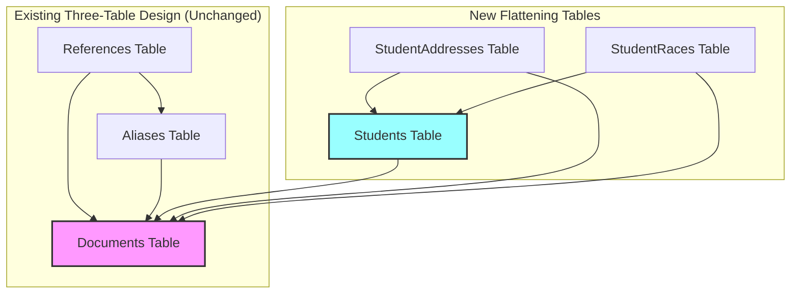

# Ed-Fi Data Management Service: Simplified Relational Flattening Design

## Executive Summary

This document describes a simplified approach to storing Ed-Fi JSON documents in relational tables alongside the existing three-table design. The flattening tables serve as a **direct replacement for the EdfiDoc JSON column** in the Documents table, providing relational access to data while maintaining the existing reference validation and uniqueness constraints.

## Core Design Principles

### 1. Minimal Complexity
- **Simple is Fast**: The simpler the flattening, the faster storage and retrieval operations
- **Easy to Understand**: Straightforward table structures reduce cognitive load
- **Maintainable**: Simple designs are easier to debug and optimize

### 2. Complementary Architecture
- The three-table design (Documents, References, Aliases) **remains unchanged**
- Reference validation and uniqueness continue to be enforced by the existing tables
- Flattening tables are purely for relational data access

### 3. Intra-Resource Relationships Only
- Surrogate-key foreign keys between tables within a single resource (e.g., Student tables)
- **No foreign keys between different resources** (e.g., Student to School)
- Cross-resource relationships continue to be managed by the References table

### 4. Flexible Implementation
- **Calibrated Complexity**: We can adjust the level of constraints based on customer feedback
- **Future Migration Path**: Design allows eventual return to EdfiDoc JSON storage
- **Reversible Decision**: Architecture supports both flattened and JSON storage models

## Architecture Overview



## Table Design Patterns

### Documents Table (Modified)

```sql
CREATE TABLE Documents (
    Id BIGINT PRIMARY KEY,
    DocumentPartitionKey TINYINT NOT NULL,
    DocumentUuid UUID NOT NULL,
    ProjectName VARCHAR(100),
    ResourceName VARCHAR(100),
    ResourceVersion VARCHAR(20),
    -- EdfiDoc JSON column REMOVED - data now in flattening tables
    CONSTRAINT UQ_Documents_Uuid UNIQUE (DocumentUuid)
);
```

### Root Entity Tables

Example: Student table

```sql
CREATE TABLE Student (
    Id BIGINT PRIMARY KEY IDENTITY(1,1),          -- Surrogate key
    DocumentUuid UUID NOT NULL,                   -- Link to Documents table
    DocumentPartitionKey TINYINT NOT NULL,        -- Partition key from Documents
    StudentUniqueId VARCHAR(100) NOT NULL,        -- Natural key component
    FirstName VARCHAR(100) NOT NULL,
    LastSurname VARCHAR(100) NOT NULL,
    BirthDate DATE,
    -- Flattened nested objects using underscore convention
    Demographics_HispanicLatinoEthnicity BIT,
    Demographics_Sex VARCHAR(20),
    ContactInfo_Email VARCHAR(255),
    ContactInfo_MobilePhone VARCHAR(20),
    CONSTRAINT FK_Student_Documents 
        FOREIGN KEY (DocumentUuid, DocumentPartitionKey) 
        REFERENCES Documents(DocumentUuid, DocumentPartitionKey) ON DELETE CASCADE,
    CONSTRAINT UQ_Student_StudentUniqueId UNIQUE (StudentUniqueId)
);
```

### Child Entity Tables

Example: StudentAddress table (array of objects)

```sql
CREATE TABLE StudentAddress (
    Id BIGINT PRIMARY KEY IDENTITY(1,1),            -- Surrogate key
    Student_Id BIGINT NOT NULL,                     -- FK to parent (prefixed to avoid collisions)
    DocumentUuid UUID NOT NULL,                     -- Link to Documents
    DocumentPartitionKey TINYINT NOT NULL,          -- Partition key from Documents
    AddressTypeDescriptor VARCHAR(100),
    StreetNumberName VARCHAR(255),
    City VARCHAR(100),
    StateAbbreviation CHAR(2),
    PostalCode VARCHAR(20),
    CONSTRAINT FK_StudentAddress_Student 
        FOREIGN KEY (Student_Id) REFERENCES Student(Id) ON DELETE CASCADE,
    CONSTRAINT FK_StudentAddress_Documents 
        FOREIGN KEY (DocumentUuid, DocumentPartitionKey) 
        REFERENCES Documents(DocumentUuid, DocumentPartitionKey) ON DELETE CASCADE,
    CONSTRAINT UQ_StudentAddress_Type 
        UNIQUE (Student_Id, AddressTypeDescriptor)
);
-- Note: Student_Id column uses prefix to avoid naming collisions with potential data columns
```

### Collection Tables

Example: StudentRace table (array of values)

```sql
CREATE TABLE StudentRace (
    Id BIGINT PRIMARY KEY IDENTITY(1,1),            -- Surrogate key
    Student_Id BIGINT NOT NULL,                     -- FK to parent (prefixed to avoid collisions)
    DocumentUuid UUID NOT NULL,                     -- Link to Documents
    DocumentPartitionKey TINYINT NOT NULL,          -- Partition key from Documents
    RaceDescriptor VARCHAR(100) NOT NULL,
    CONSTRAINT FK_StudentRace_Student 
        FOREIGN KEY (Student_Id) REFERENCES Student(Id) ON DELETE CASCADE,
    CONSTRAINT FK_StudentRace_Documents 
        FOREIGN KEY (DocumentUuid, DocumentPartitionKey) 
        REFERENCES Documents(DocumentUuid, DocumentPartitionKey) ON DELETE CASCADE
);
```

## Flattening Process

### Write Path: JSON to Relational

```csharp
public async Task FlattenDocument(string jsonDocument, Guid documentUuid, byte documentPartitionKey)
{
    var json = JObject.Parse(jsonDocument);
    
    using var transaction = connection.BeginTransaction();
    
    // 1. Insert root entity
    var studentId = await connection.QuerySingleAsync<long>(@"
        INSERT INTO Student (DocumentUuid, DocumentPartitionKey, StudentUniqueId, 
                           FirstName, LastSurname, BirthDate, 
                           Demographics_HispanicLatinoEthnicity, 
                           Demographics_Sex, ContactInfo_Email, ContactInfo_MobilePhone)
        VALUES (@DocumentUuid, @DocumentPartitionKey, @StudentUniqueId, 
                @FirstName, @LastSurname, @BirthDate, @HispanicLatino, 
                @Sex, @Email, @MobilePhone)
        RETURNING Id",
        new {
            DocumentUuid = documentUuid,
            DocumentPartitionKey = documentPartitionKey,
            StudentUniqueId = json["studentUniqueId"],
            FirstName = json["firstName"],
            LastSurname = json["lastSurname"],
            BirthDate = json["birthDate"],
            HispanicLatino = json["demographics"]?["hispanicLatinoEthnicity"],
            Sex = json["demographics"]?["sex"],
            Email = json["contactInfo"]?["email"],
            MobilePhone = json["contactInfo"]?["mobilePhone"]
        }, transaction);
    
    // 2. Insert child arrays
    var addresses = json["addresses"] as JArray;
    if (addresses != null)
    {
        foreach (var address in addresses)
        {
            await connection.ExecuteAsync(@"
                INSERT INTO StudentAddress (Student_Id, DocumentUuid, DocumentPartitionKey,
                                          AddressTypeDescriptor, StreetNumberName, 
                                          City, StateAbbreviation, PostalCode)
                VALUES (@StudentId, @DocumentUuid, @DocumentPartitionKey, 
                        @AddressType, @Street, @City, @State, @PostalCode)",
                new {
                    StudentId = studentId,
                    DocumentUuid = documentUuid,
                    DocumentPartitionKey = documentPartitionKey,
                    AddressType = address["addressTypeDescriptor"],
                    Street = address["streetNumberName"],
                    City = address["city"],
                    State = address["stateAbbreviation"],
                    PostalCode = address["postalCode"]
                }, transaction);
        }
    }
    
    transaction.Commit();
}
```

### Read Path: Relational to JSON

Using modern database JSON capabilities:

```sql
-- SQL Server implementation
CREATE PROCEDURE GetStudentJson
    @DocumentUuid UUID,
    @DocumentPartitionKey TINYINT
AS
BEGIN
    SELECT
        s.StudentUniqueId AS 'studentUniqueId',
        s.FirstName AS 'firstName',
        s.LastSurname AS 'lastSurname',
        s.BirthDate AS 'birthDate',
        -- Nested demographics object
        JSON_QUERY(
            (SELECT
                s.Demographics_HispanicLatinoEthnicity AS 'hispanicLatinoEthnicity',
                s.Demographics_Sex AS 'sex'
            FOR JSON PATH, WITHOUT_ARRAY_WRAPPER)
        ) AS 'demographics',
        -- Nested contact info
        JSON_QUERY(
            (SELECT
                s.ContactInfo_Email AS 'email',
                s.ContactInfo_MobilePhone AS 'mobilePhone'
            FOR JSON PATH, WITHOUT_ARRAY_WRAPPER)
        ) AS 'contactInfo',
        -- Addresses array
        (
            SELECT
                sa.AddressTypeDescriptor AS 'addressTypeDescriptor',
                sa.StreetNumberName AS 'streetNumberName',
                sa.City AS 'city',
                sa.StateAbbreviation AS 'stateAbbreviation',
                sa.PostalCode AS 'postalCode'
            FROM StudentAddress sa
            WHERE sa.Student_Id = s.Id
            FOR JSON PATH
        ) AS 'addresses',
        -- Races array
        (
            SELECT sr.RaceDescriptor AS 'raceDescriptor'
            FROM StudentRace sr
            WHERE sr.Student_Id = s.Id
            FOR JSON PATH
        ) AS 'races'
    FROM Student s
    WHERE s.DocumentUuid = @DocumentUuid 
      AND s.DocumentPartitionKey = @DocumentPartitionKey
    FOR JSON PATH, WITHOUT_ARRAY_WRAPPER
END
```

## MetaEd Code Generation

MetaEd will generate:

1. **Table DDL Scripts**: CREATE TABLE statements for each entity
2. **Flattening Code**: C# methods or database functions to decompose JSON
3. **Unflattening Queries**: SQL SELECT statements with FOR JSON clauses
4. **Index Definitions**: Appropriate indexes based on entity relationships

Example MetaEd template for flattening generation:

```typescript
function generateFlatteningCode(entity: Entity): string {
    const tableName = pluralize(entity.name);
    const columns = flattenProperties(entity.properties);
    
    return `
        INSERT INTO ${tableName} (${columns.map(c => c.name).join(', ')})
        VALUES (${columns.map(c => `@${c.name}`).join(', ')})
    `;
}

function generateUnflatteningQuery(entity: Entity): string {
    const selections = entity.properties.map(prop => {
        if (prop.isObject) {
            return generateNestedObject(prop);
        } else if (prop.isArray) {
            return generateArraySubquery(prop);
        } else {
            return `${prop.columnName} AS '${prop.jsonPath}'`;
        }
    });
    
    return `SELECT ${selections.join(', ')} FOR JSON PATH, WITHOUT_ARRAY_WRAPPER`;
}
```

## Performance Considerations

### Indexing Strategy

```sql
-- Primary indexes (automatic with PRIMARY KEY)
-- Already created on Id columns

-- Unique indexes on natural keys
-- Already created as UNIQUE constraints (which create unique indexes)

-- Document relationship indexes
CREATE INDEX IX_Student_DocumentUuid ON Student(DocumentUuid, DocumentPartitionKey);
CREATE INDEX IX_StudentAddress_DocumentUuid ON StudentAddress(DocumentUuid, DocumentPartitionKey);

-- Parent-child relationship indexes
CREATE INDEX IX_StudentAddress_Student_Id ON StudentAddress(Student_Id);
CREATE INDEX IX_StudentRace_Student_Id ON StudentRace(Student_Id);
```

### Query Optimization

1. **Bulk Operations**: Use table-valued parameters for batch inserts
2. **Parallel Processing**: Process independent resources concurrently
3. **Connection Pooling**: Reuse database connections efficiently
4. **Prepared Statements**: Cache query plans for repeated operations

## Benefits of This Approach

### 1. Simplicity
- Straightforward table structures anyone can understand
- No complex natural key relationships to maintain
- Clear separation between validation (three-table) and storage (flattening)

### 2. Performance
- Minimal overhead during write operations
- Efficient JSON reconstruction using database features
- Simple indexes that are easy to optimize

### 3. Flexibility
- **Adjustable Constraint Levels**: Can add unique indexes, additional FKs, or check constraints based on customer needs
- **Progressive Enhancement**: Start simple, add complexity only where proven necessary
- **Feedback-Driven Evolution**: Real usage patterns will inform optimization decisions

### 4. Maintainability
- Generated code is simple and predictable
- Easy to debug and troubleshoot
- Clear data lineage from JSON to tables

### 5. Strategic Reversibility
- **Dual-Mode Support**: Can run with both flattened tables and EdfiDoc column
- **Graceful Migration Path**: When customers are ready, can transition back to pure JSON storage
- **Investment Protection**: Work done on flattening informs future JSON query optimization

## Migration Strategy

### Phase 1: Introduction (Customer Adoption)
1. Deploy flattened tables alongside EdfiDoc column
2. Enable dual-write mode for data consistency
3. Allow customers to choose their query path
4. Gather usage metrics and feedback

### Phase 2: Optimization (Refinement)
1. Adjust constraint levels based on customer needs
2. Add indexes where query patterns demand them
3. Fine-tune the balance between simplicity and functionality
4. Document best practices from real-world usage

### Phase 3: Maturity (Strategic Decision)
1. Evaluate if direct database access is still required
2. Assess improvements in API and tooling that reduce DB access needs
3. Plan potential migration back to EdfiDoc if appropriate
4. Maintain dual-mode capability for gradual transition

### Future State Options
- **Option A**: Continue with flattened tables if customer value is high
- **Option B**: Return to EdfiDoc when API/tooling eliminates direct DB needs
- **Option C**: Hybrid approach with selective flattening for high-value entities

## Conclusion

This simplified relational flattening design provides a pragmatic bridge between current customer needs and our long-term architectural vision. By keeping the flattening logic simple and leveraging modern database JSON capabilities, we achieve:

- **Fast** storage and retrieval operations
- **Simple** code that's easy to understand and maintain
- **Flexible** schema that can evolve based on customer feedback
- **Compatible** with existing reference validation mechanisms
- **Reversible** architecture that preserves future options

### Strategic Value

This approach allows us to:
1. **Meet immediate customer needs** for direct database access
2. **Learn from real usage** to inform future decisions
3. **Maintain architectural flexibility** to adapt as requirements evolve
4. **Build a migration path** toward API-centric access patterns

The design philosophy of "as simple as possible, but no simpler" ensures that we can find the right balance for all customers while keeping the door open for future architectural improvements. As our API and tooling mature, we can gradually guide customers away from direct database access, ultimately returning to the cleaner EdfiDoc column approach when the ecosystem is ready.