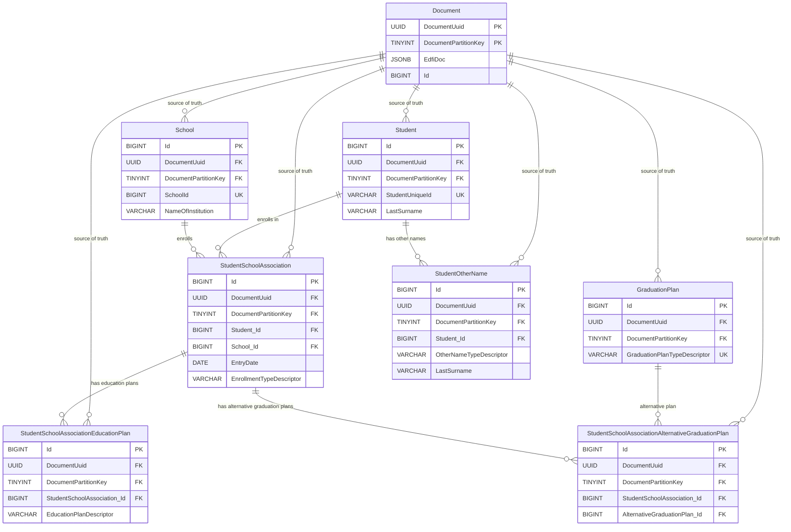
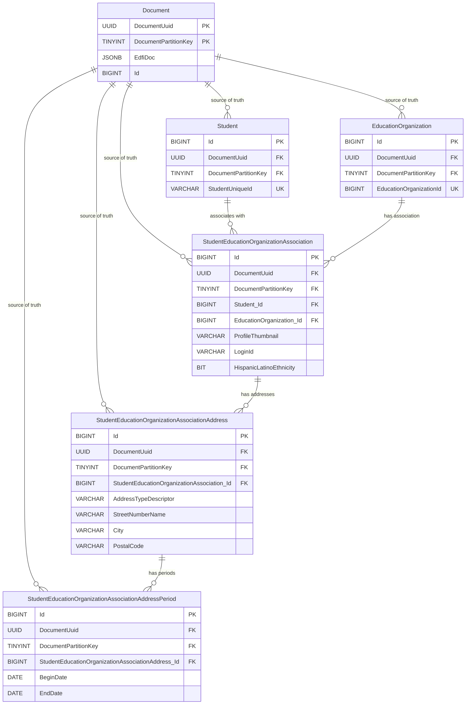
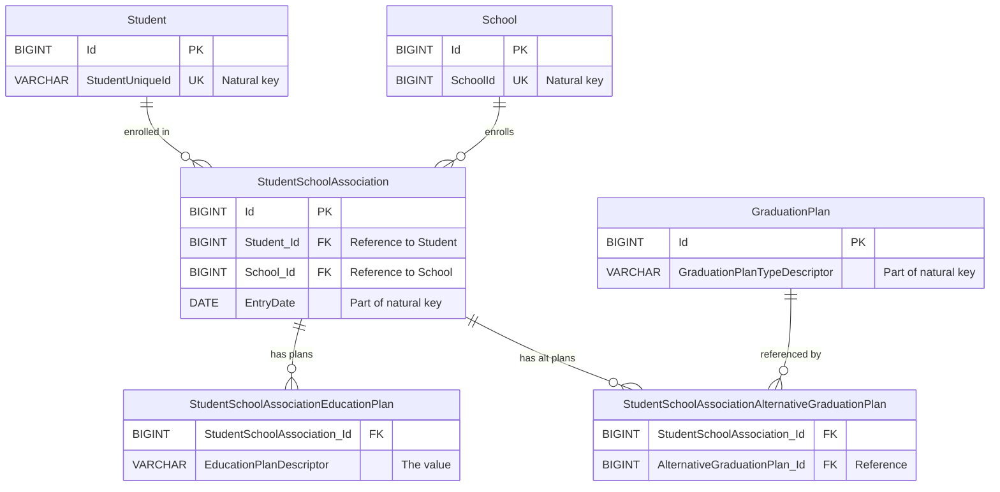
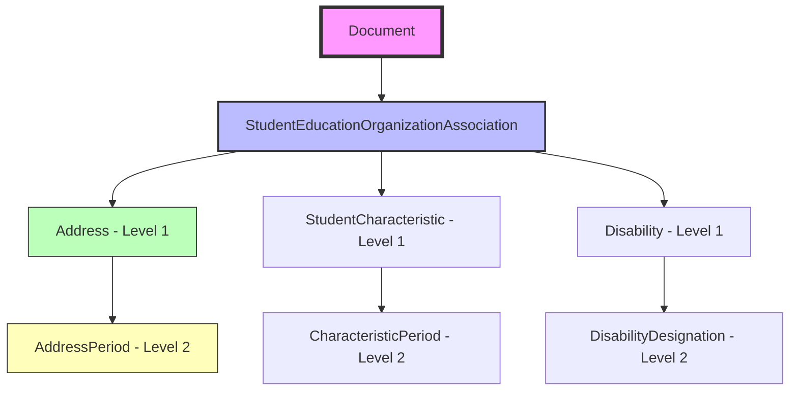
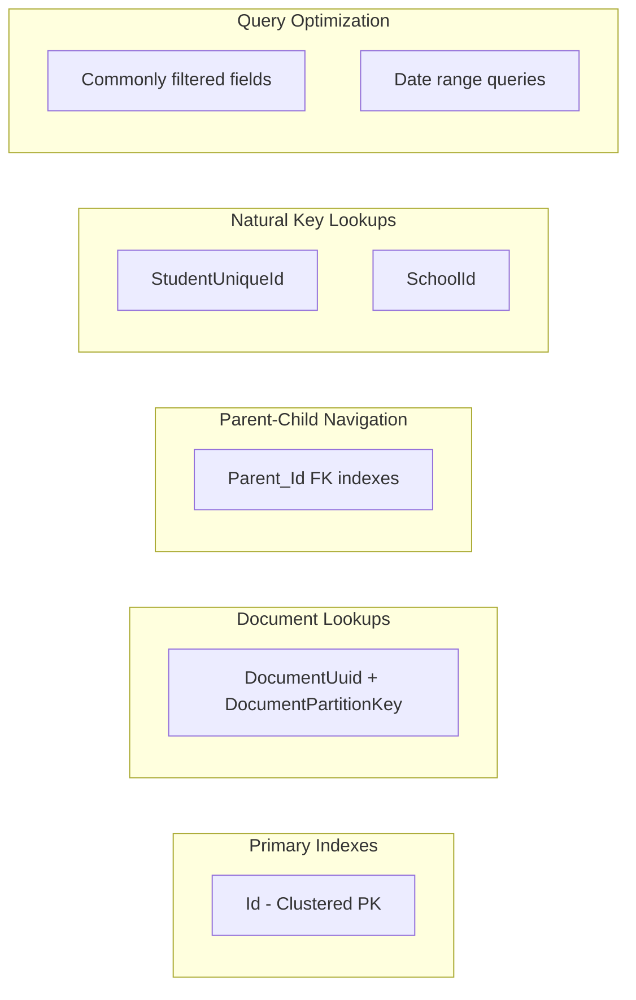

# StudentSchoolAssociation Entity Relationship Diagrams

## Overview
This document provides Entity Relationship Diagrams (ERDs) for the flattened table structures, separated into two main groupings:
1. StudentSchoolAssociation and its relationships
2. StudentEducationOrganizationAssociation with multi-level sub-tables

## Diagram 1: StudentSchoolAssociation Grouping



## Diagram 2: StudentEducationOrganizationAssociation Multi-Level Grouping



## Relationship Annotations

### 1. Document Table Relationships
**Pattern**: Every flattened table maintains a foreign key back to the Document table
- **Purpose**: Maintains traceability and source of truth
- **Constraint**: `ON DELETE CASCADE` ensures flattened data is removed when Document is deleted
- **Keys**: Composite FK on (DocumentUuid, DocumentPartitionKey)

### 2. Cross-Resource Relationships
**Pattern**: References between different root resources (e.g., Student → School)
- **Management**: Reference validation handled by existing Reference table
- **Foreign Keys**: Surrogate keys stored but not enforced as FKs in flattened tables
- **Examples**:
  - StudentSchoolAssociation → Student
  - StudentSchoolAssociation → School
  - StudentSchoolAssociation → GraduationPlan

### 3. Intra-Resource Relationships (Same Resource Hierarchy)
**Pattern**: Parent-child relationships within the same resource boundary
- **Foreign Keys**: Enforced with CASCADE DELETE
- **Examples**:
  - Student → StudentOtherName (one-to-many)
  - StudentSchoolAssociation → StudentSchoolAssociationEducationPlan (one-to-many)
  - StudentEducationOrganizationAssociation → StudentEducationOrganizationAssociationAddress (one-to-many)

### 4. Multi-Level Sub-Table Relationships
**Pattern**: Second-level child tables reference their immediate parent, not the root
- **Hierarchy**: Root → First-Level Sub-Table → Second-Level Sub-Table
- **Example Chain**:
  - StudentEducationOrganizationAssociation (root)
  - → StudentEducationOrganizationAssociationAddress (level 1)
  - → StudentEducationOrganizationAssociationAddressPeriod (level 2)

## Simplified View: StudentSchoolAssociation Focus



## Key Design Principles Illustrated

### 1. Surrogate Keys Everywhere
- All tables use `BIGINT IDENTITY(1,1)` as primary key
- Natural keys become unique constraints, not primary keys

### 2. Foreign Key Naming Convention
- FK columns prefixed with parent table name + "_Id"
- Example: `Student_Id`, `School_Id`, `StudentSchoolAssociation_Id`

### 3. Uniqueness Constraints
- Root tables: Natural key fields
- Child tables: Parent FK + identifying fields
- Second-level: Immediate parent FK + identifying fields

### 4. Cascade Behavior
```
Document deletion → cascades to all flattened tables
Root table deletion → cascades to child tables
First-level deletion → cascades to second-level tables
```

### 5. Reference Table Integration
- Cross-resource relationships validated by Reference table
- Flattened tables store surrogate keys for query performance
- Reference table prevents orphaned references

## Multi-Level Hierarchy Example



## Index Strategy Visualization



## Notes on ERD Interpretation

1. **Cardinality Notation**:
   - `||` = one (mandatory)
   - `o{` = zero or many
   - Example: `Student ||--o{ StudentOtherName` means "one Student has zero or many OtherNames"

2. **Foreign Key Types**:
   - **Solid lines**: Enforced foreign keys (intra-resource)
   - **Conceptual relationships**: Cross-resource references (managed by Reference table)

3. **Cascade Rules**:
   - All relationships from Document use CASCADE DELETE
   - Intra-resource relationships use CASCADE DELETE
   - Cross-resource relationships rely on Reference table constraints

4. **Multi-Level Considerations**:
   - Each level only knows about its immediate parent
   - Deletion cascades flow through all levels
   - Query reconstruction requires joining through each level