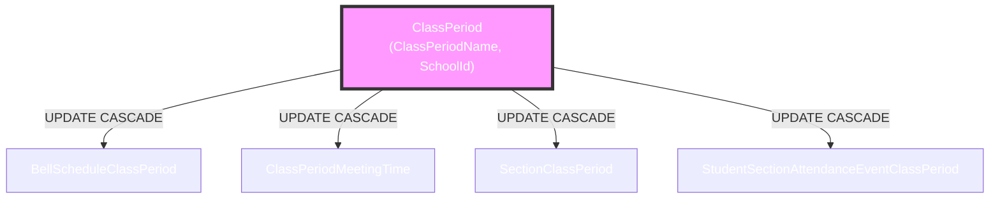
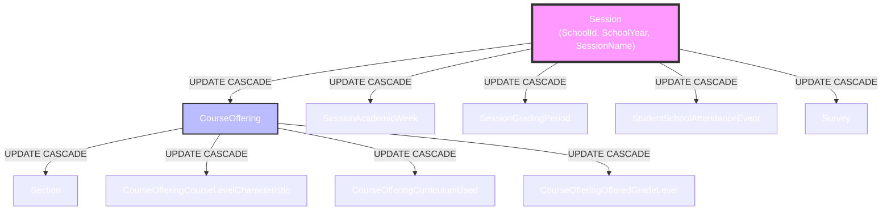
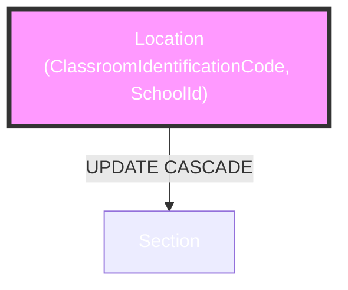
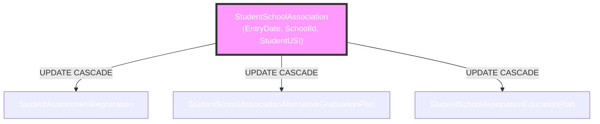
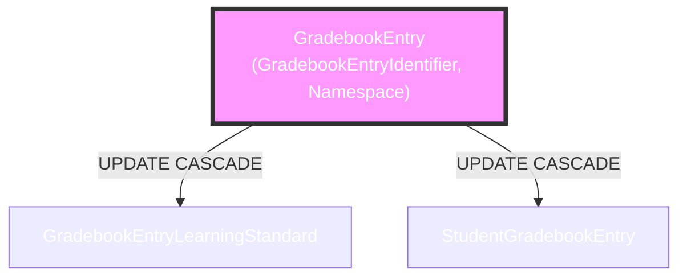
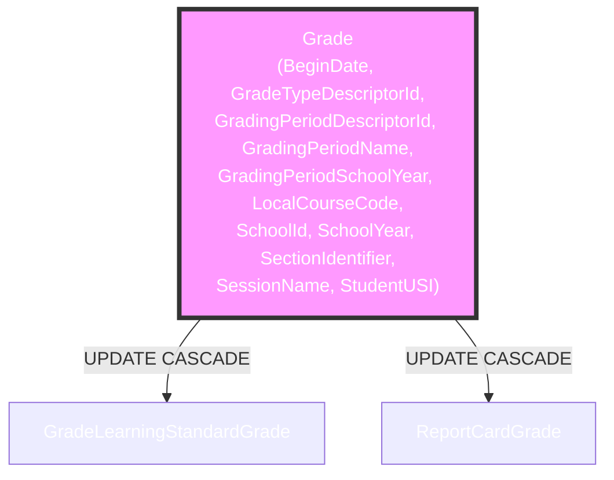

# Aggregate Root Tables with CASCADE UPDATE Foreign Keys

This document analyzes the foreign key relationships in the Ed-Fi ODS v7.3 SQL Server database that have `ON UPDATE CASCADE` configured. These relationships allow primary key updates to propagate through the dependency graph.

## Overview

The analysis reveals several key aggregate root tables that serve as sources for cascading updates:

1. **ClassPeriod** - School scheduling periods
2. **Session** - School year sessions  
3. **CourseOffering** - Course offerings within sessions
4. **Section** - Course sections
5. **Location** - Physical locations/classrooms
6. **StudentSchoolAssociation** - Student enrollment
7. **StudentSectionAssociation** - Student section enrollment
8. **GradebookEntry** - Gradebook entries
9. **Grade** - Student grades

## Cascade Relationships by Aggregate Root

### 1. ClassPeriod Cascade Chain

The ClassPeriod entity allows primary key updates that cascade to scheduling-related entities:

### 2. Session Cascade Chain

The Session entity is a major aggregate root with extensive cascading relationships:

### 3. Section Cascade Chain

The Section entity is central to course management with numerous dependent entities:

```mermaid
graph TD
    Section["Section<br/>(LocalCourseCode, SchoolId, SchoolYear,<br/>SectionIdentifier, SessionName)"]
    
    Section -->|UPDATE CASCADE| AssessmentSection
    Section -->|UPDATE CASCADE| CourseTranscriptSection
    Section -->|UPDATE CASCADE| GradebookEntry
    Section -->|UPDATE CASCADE| SectionAttendanceTakenEvent
    Section -->|UPDATE CASCADE| SectionCharacteristic
    Section -->|UPDATE CASCADE| SectionClassPeriod
    Section -->|UPDATE CASCADE| SectionCourseLevelCharacteristic
    Section -->|UPDATE CASCADE| SectionOfferedGradeLevel
    Section -->|UPDATE CASCADE| SectionProgram
    Section -->|UPDATE CASCADE| StaffSectionAssociation
    Section -->|UPDATE CASCADE| StudentCohortAssociationSection
    Section -->|UPDATE CASCADE| StudentSectionAssociation
    Section -->|UPDATE CASCADE| StudentSectionAttendanceEvent
    Section -->|UPDATE CASCADE| SurveySectionAssociation
    
    StudentSectionAssociation -->|UPDATE CASCADE| Grade
    StudentSectionAssociation -->|UPDATE CASCADE| StudentCompetencyObjectiveStudentSectionAssociation
    StudentSectionAssociation -->|UPDATE CASCADE| StudentSectionAssociationProgram
    
    style Section fill:#f9f,stroke:#333,stroke-width:4px,color:#fff
    style StudentSectionAssociation fill:#bbf,stroke:#333,stroke-width:2px,color:#fff
    style AssessmentSection color:#fff
    style CourseTranscriptSection color:#fff
    style GradebookEntry color:#fff
    style SectionAttendanceTakenEvent color:#fff
    style SectionCharacteristic color:#fff
    style SectionClassPeriod color:#fff
    style SectionCourseLevelCharacteristic color:#fff
    style SectionOfferedGradeLevel color:#fff
    style SectionProgram color:#fff
    style StaffSectionAssociation color:#fff
    style StudentCohortAssociationSection color:#fff
    style StudentSectionAttendanceEvent color:#fff
    style SurveySectionAssociation color:#fff
    style Grade color:#fff
    style StudentCompetencyObjectiveStudentSectionAssociation color:#fff
    style StudentSectionAssociationProgram color:#fff
```

### 4. Location Cascade Chain

The Location entity manages physical spaces:

### 5. StudentSchoolAssociation Cascade Chain

Student enrollment cascades to related records:

### 6. GradebookEntry Cascade Chain

Gradebook entries cascade to student entries and learning standards:

### 7. Grade Cascade Chain

Grades cascade to report cards and learning standard grades:

## Complete Cascade Hierarchy

This diagram shows the complete cascade hierarchy with all relationships:

```mermaid
graph TD
    Session["Session"]
    CourseOffering["CourseOffering"]
    Section["Section"]
    ClassPeriod["ClassPeriod"]
    Location["Location"]
    StudentSchoolAssociation["StudentSchoolAssociation"]
    StudentSectionAssociation["StudentSectionAssociation"]
    GradebookEntry["GradebookEntry"]
    Grade["Grade"]
    
    %% Session cascades
    Session -->|CASCADE| CourseOffering
    Session -->|CASCADE| SessionAcademicWeek
    Session -->|CASCADE| SessionGradingPeriod
    Session -->|CASCADE| StudentSchoolAttendanceEvent
    Session -->|CASCADE| Survey
    
    %% CourseOffering cascades
    CourseOffering -->|CASCADE| Section
    CourseOffering -->|CASCADE| CourseOfferingCourseLevelCharacteristic
    CourseOffering -->|CASCADE| CourseOfferingCurriculumUsed
    CourseOffering -->|CASCADE| CourseOfferingOfferedGradeLevel
    
    %% Section cascades
    Section -->|CASCADE| AssessmentSection
    Section -->|CASCADE| CourseTranscriptSection
    Section -->|CASCADE| GradebookEntry
    Section -->|CASCADE| SectionAttendanceTakenEvent
    Section -->|CASCADE| SectionCharacteristic
    Section -->|CASCADE| SectionClassPeriod
    Section -->|CASCADE| SectionCourseLevelCharacteristic
    Section -->|CASCADE| SectionOfferedGradeLevel
    Section -->|CASCADE| SectionProgram
    Section -->|CASCADE| StaffSectionAssociation
    Section -->|CASCADE| StudentCohortAssociationSection
    Section -->|CASCADE| StudentSectionAssociation
    Section -->|CASCADE| StudentSectionAttendanceEvent
    Section -->|CASCADE| SurveySectionAssociation
    
    %% Location cascades
    Location -->|CASCADE| Section
    
    %% ClassPeriod cascades
    ClassPeriod -->|CASCADE| BellScheduleClassPeriod
    ClassPeriod -->|CASCADE| ClassPeriodMeetingTime
    ClassPeriod -->|CASCADE| SectionClassPeriod
    ClassPeriod -->|CASCADE| StudentSectionAttendanceEventClassPeriod
    
    %% StudentSchoolAssociation cascades
    StudentSchoolAssociation -->|CASCADE| StudentAssessmentRegistration
    StudentSchoolAssociation -->|CASCADE| StudentSchoolAssociationAlternativeGraduationPlan
    StudentSchoolAssociation -->|CASCADE| StudentSchoolAssociationEducationPlan
    
    %% StudentSectionAssociation cascades
    StudentSectionAssociation -->|CASCADE| Grade
    StudentSectionAssociation -->|CASCADE| StudentCompetencyObjectiveStudentSectionAssociation
    StudentSectionAssociation -->|CASCADE| StudentSectionAssociationProgram
    
    %% GradebookEntry cascades
    GradebookEntry -->|CASCADE| GradebookEntryLearningStandard
    GradebookEntry -->|CASCADE| StudentGradebookEntry
    
    %% Grade cascades
    Grade -->|CASCADE| GradeLearningStandardGrade
    Grade -->|CASCADE| ReportCardGrade
    
    style Session fill:#f9f,stroke:#333,stroke-width:4px,color:#fff
    style CourseOffering fill:#bbf,stroke:#333,stroke-width:2px,color:#fff
    style Section fill:#bbf,stroke:#333,stroke-width:2px,color:#fff
    style ClassPeriod fill:#f9f,stroke:#333,stroke-width:4px,color:#fff
    style Location fill:#f9f,stroke:#333,stroke-width:4px,color:#fff
    style StudentSchoolAssociation fill:#f9f,stroke:#333,stroke-width:4px,color:#fff
    style StudentSectionAssociation fill:#bbf,stroke:#333,stroke-width:2px,color:#fff
    style GradebookEntry fill:#bbf,stroke:#333,stroke-width:2px,color:#fff
    style Grade fill:#bfb,stroke:#333,stroke-width:2px,color:#fff
    
    %% Style all other nodes with white text
    style SessionAcademicWeek color:#fff
    style SessionGradingPeriod color:#fff
    style StudentSchoolAttendanceEvent color:#fff
    style Survey color:#fff
    style CourseOfferingCourseLevelCharacteristic color:#fff
    style CourseOfferingCurriculumUsed color:#fff
    style CourseOfferingOfferedGradeLevel color:#fff
    style AssessmentSection color:#fff
    style CourseTranscriptSection color:#fff
    style SectionAttendanceTakenEvent color:#fff
    style SectionCharacteristic color:#fff
    style SectionClassPeriod color:#fff
    style SectionCourseLevelCharacteristic color:#fff
    style SectionOfferedGradeLevel color:#fff
    style SectionProgram color:#fff
    style StaffSectionAssociation color:#fff
    style StudentCohortAssociationSection color:#fff
    style StudentSectionAttendanceEvent color:#fff
    style SurveySectionAssociation color:#fff
    style BellScheduleClassPeriod color:#fff
    style ClassPeriodMeetingTime color:#fff
    style StudentSectionAttendanceEventClassPeriod color:#fff
    style StudentAssessmentRegistration color:#fff
    style StudentSchoolAssociationAlternativeGraduationPlan color:#fff
    style StudentSchoolAssociationEducationPlan color:#fff
    style StudentCompetencyObjectiveStudentSectionAssociation color:#fff
    style StudentSectionAssociationProgram color:#fff
    style GradebookEntryLearningStandard color:#fff
    style StudentGradebookEntry color:#fff
    style GradeLearningStandardGrade color:#fff
    style ReportCardGrade color:#fff
```

## Summary

The cascade update pattern in the Ed-Fi ODS follows a hierarchical structure where:

1. **Top-level aggregate roots** (marked in pink in diagrams):
   - Session
   - ClassPeriod  
   - Location
   - StudentSchoolAssociation

2. **Mid-level aggregates** (marked in light blue):
   - CourseOffering (cascades from Session)
   - Section (cascades from CourseOffering and Location)
   - StudentSectionAssociation (cascades from Section)
   - GradebookEntry (cascades from Section)

3. **Leaf-level entities** (marked in light green):
   - Grade (cascades from StudentSectionAssociation)
   - Various characteristic and association tables

### Cascade Update Statistics

**Tables receiving cascade updates by aggregate root:**

- **Section**: 14 direct cascades (AssessmentSection, CourseTranscriptSection, GradebookEntry, SectionAttendanceTakenEvent, SectionCharacteristic, SectionClassPeriod, SectionCourseLevelCharacteristic, SectionOfferedGradeLevel, SectionProgram, StaffSectionAssociation, StudentCohortAssociationSection, StudentSectionAssociation, StudentSectionAttendanceEvent, SurveySectionAssociation)
- **Session**: 5 direct cascades (CourseOffering, SessionAcademicWeek, SessionGradingPeriod, StudentSchoolAttendanceEvent, Survey)
- **ClassPeriod**: 4 direct cascades (BellScheduleClassPeriod, ClassPeriodMeetingTime, SectionClassPeriod, StudentSectionAttendanceEventClassPeriod)
- **CourseOffering**: 4 direct cascades (Section, CourseOfferingCourseLevelCharacteristic, CourseOfferingCurriculumUsed, CourseOfferingOfferedGradeLevel)
- **StudentSchoolAssociation**: 3 direct cascades (StudentAssessmentRegistration, StudentSchoolAssociationAlternativeGraduationPlan, StudentSchoolAssociationEducationPlan)
- **StudentSectionAssociation**: 3 direct cascades (Grade, StudentCompetencyObjectiveStudentSectionAssociation, StudentSectionAssociationProgram)
- **GradebookEntry**: 2 direct cascades (GradebookEntryLearningStandard, StudentGradebookEntry)
- **Grade**: 2 direct cascades (GradeLearningStandardGrade, ReportCardGrade)
- **Location**: 1 direct cascade (Section)

**Total unique tables receiving cascade updates: 38**

This includes all tables that have foreign keys with `ON UPDATE CASCADE` defined, representing a significant portion of the Ed-Fi ODS relational model where primary key changes need to propagate to maintain referential integrity.

The cascade update mechanism ensures referential integrity when primary keys change, particularly important for:
- School year transitions
- Course restructuring
- Student enrollment changes
- Schedule modifications

This design allows the Ed-Fi system to maintain consistency across complex educational data relationships while supporting necessary administrative changes to key identifiers.