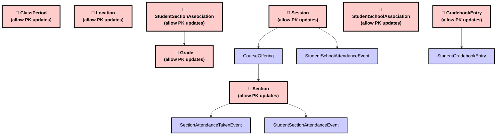
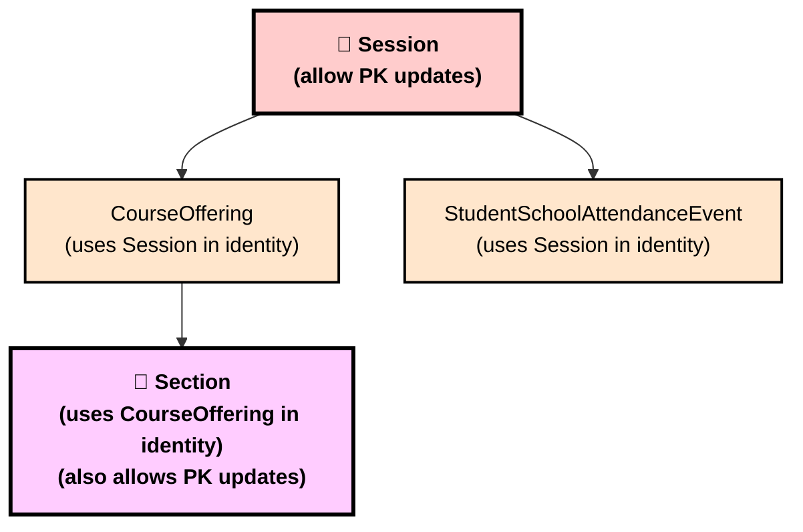
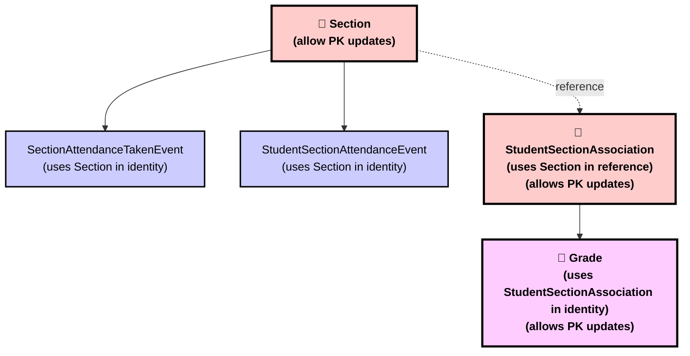
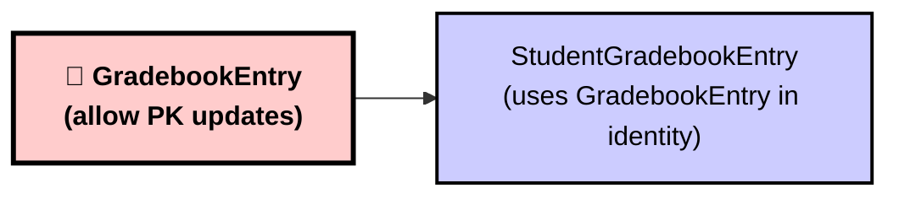
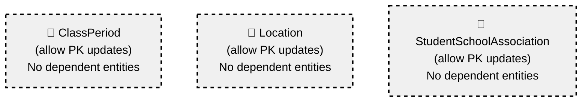

# Ed-Fi Data Standard 5.2 - Primary Key Updates Transitive Impact Analysis

## Overview

This document analyzes all entities in Ed-Fi Data Standard 5.2 that have "allow primary key updates" defined and maps their transitive identity relationships. The analysis shows which entities would be impacted by primary key changes through their identity dependencies.

## Entities with "Allow Primary Key Updates"

Eight entities in Data Standard 5.2 allow primary key updates:

### 1. ClassPeriod
- **Identity**: School, ClassPeriodName
- **Documentation**: Represents the designation of a regularly scheduled series of class meetings at designated times and days of the week

### 2. Location  
- **Identity**: School, ClassroomIdentificationCode
- **Documentation**: Represents the physical space where students gather for a particular class/section

### 3. Session
- **Identity**: SessionName, SchoolYear, School
- **Documentation**: A specific designated unit of time during which instruction is provided, grades are reported and academic credits are awarded

### 4. Section
- **Identity**: SectionIdentifier, CourseOffering
- **Documentation**: Represents a setting in which organized instruction of course content is provided to one or more students

### 5. GradebookEntry
- **Identity**: GradebookEntryIdentifier, Namespace
- **Documentation**: Represents an assignment, homework, or classroom assessment to be recorded in a gradebook

### 6. Grade
- **Identity**: GradeType, StudentSectionAssociation, GradingPeriod  
- **Documentation**: Represents an overall score or assessment tied to a course over a period of time

### 7. StudentSchoolAssociation
- **Identity**: Student, School, EntryDate
- **Documentation**: Represents the school in which a student is enrolled

### 8. StudentSectionAssociation
- **Identity**: Student, Section, BeginDate
- **Documentation**: Indicates the course sections to which a student is assigned

## Transitive Dependency Analysis

### Direct Dependencies (First Level)

The following entities directly reference primary key updatable entities as part of their identity:

| Source Entity | Target Entity | Relationship Type |
|--------------|---------------|-------------------|
| Session | CourseOffering | CourseOffering uses Session in identity |
| Session | StudentSchoolAttendanceEvent | Attendance event uses Session in identity |
| Section | SectionAttendanceTakenEvent | Attendance taken uses Section in identity |
| Section | StudentSectionAttendanceEvent | Student attendance uses Section in identity |
| GradebookEntry | StudentGradebookEntry | Student entry uses GradebookEntry in identity |
| StudentSectionAssociation | Grade | Grade uses StudentSectionAssociation in identity |

### Cascading Dependencies (Second Level and Beyond)

| Level | Chain | Impact |
|-------|-------|--------|
| 4 | Session → CourseOffering → Section → StudentSectionAssociation → Grade | Grade transitively depends on Session through multiple levels |
| 2 | Session → CourseOffering → Section | Section transitively depends on Session |
| 1 | StudentSectionAssociation → Grade | Grade directly depends on StudentSectionAssociation |
| 1 | GradebookEntry → StudentGradebookEntry | Direct dependency only |

## Mermaid Dependency Diagrams

### Complete Dependency Graph

### Session Cascade Impact

### Section Dependencies Network

### Gradebook Dependencies

### Isolated Entities (No Dependencies)

## Impact Summary

### High Impact Entities (3+ dependencies)
- **Session**: Affects 3 entities (CourseOffering, Section transitively, StudentSchoolAttendanceEvent)

### Medium Impact Entities (2 dependencies)
- **Section**: Affects 2 entities (SectionAttendanceTakenEvent, StudentSectionAttendanceEvent)

### Low Impact Entities (1 dependency)
- **GradebookEntry**: Affects StudentGradebookEntry
- **StudentSectionAssociation**: Affects Grade

### No Impact Entities (0 dependencies)
- **ClassPeriod**: No entities reference it in their identity
- **Location**: No entities reference it in their identity
- **Grade**: No entities reference it in their identity (terminal entity)
- **StudentSchoolAssociation**: No entities reference it in their identity

## Key Findings

1. **Moderate Cascading Depth**: The maximum transitive dependency depth is 4 levels (Session → CourseOffering → Section → StudentSectionAssociation → Grade), which requires careful consideration for cascading updates but is still manageable.

2. **Session is Critical**: Session has the highest cascading impact, affecting the entire course offering and section structure, plus attendance tracking.

3. **Functional Isolation**: The dependency chains are isolated within functional areas:
   - Scheduling/Attendance: Session → CourseOffering → Section → Attendance Events
   - Gradebook: GradebookEntry → StudentGradebookEntry
   - Grading: StudentSectionAssociation → Grade

4. **Circular Dependencies**: Note that Section both allows primary key updates AND depends on CourseOffering (which depends on Session). This creates a complex update scenario where Section's identity can change both directly and indirectly.

5. **Attendance Tracking Vulnerability**: Most attendance-related entities depend on primary key updatable entities, making attendance data particularly sensitive to key changes.

## Recommendations

1. **Session Updates**: Exercise extreme caution when updating Session primary keys as they have the widest cascading impact.

2. **Section Management**: Be aware that Section can be affected by both direct primary key updates and cascading updates from Session changes.

3. **Attendance Data**: Implement robust referential integrity checks for attendance events as they depend heavily on updatable keys.

4. **Update Order**: When performing primary key updates, follow this order to minimize conflicts:
   1. Session
   2. CourseOffering (if needed)
   3. Section
   4. Dependent attendance and grade entities

5. **Isolated Entities**: ClassPeriod, Location, and StudentSchoolAssociation can be updated more freely as they have no dependent entities.